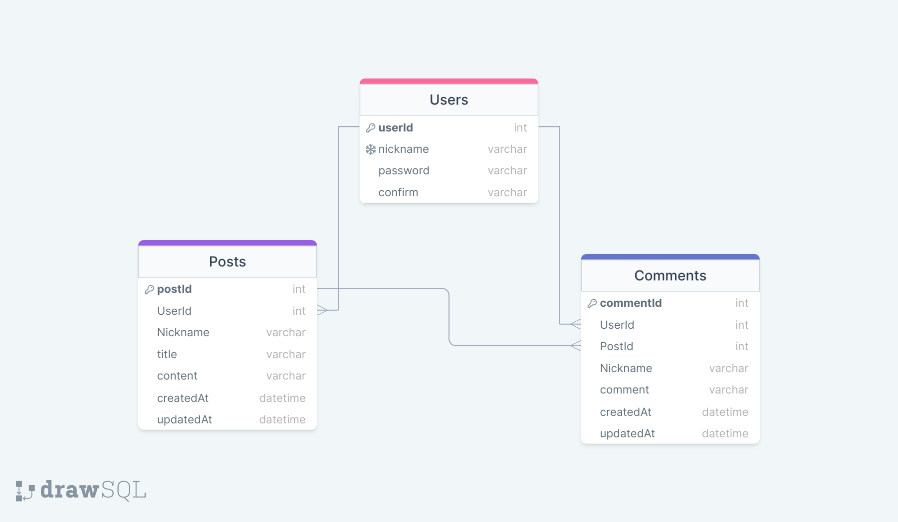

### ERD

### 진행 및 회고 TIL 노션 링크
https://marioa.notion.site/Node-js-Lv3-TIL-9-6-b86f0d3f9ed942689c4b5d630669fce7?pvs=4

### 페어 리뷰 후, 수정 사항

1. 테이블 구조 변경 -> nickname을 Posts, Comments에 넣을 필요 없이, `select: {}, User: { ~} `방식으로 가져오면 됨
- 따라서, 기존에 했던 nickname 외래키로 정할지에 대한 고민도 애초에 할 필요 없었던 것

2. confirm까지 같이 생성했던 부분 수정 -> 같이 할 필요x

3. 401에러를 위해 억지로 만들어 놓은 isDeleted, isUpdated 변수 -> 일부 삭제(의미x)